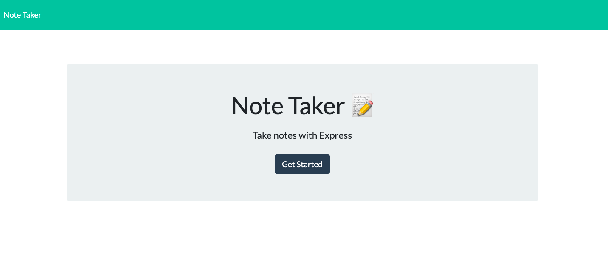

# Note_Taker
## Table of Contents
- Description
- Installation
- Usage
- Contribution
- License & Copyright
- Questions

## Description:
This is a Note Taker Application that runs in the brower. This application will use an Express.js back end and will save and retrieve note data from a JSON file. You are able to write and save notes in the Note Taker to organize your thoughts and keep track of tasks which need to be completed.

## Installation:
Express.js

## Usage(How to use):
WHEN you click on the link to the notes page, Then a page with existing notes listed in the left-hand column, plus empty fields to enter a new note title and the note’s text in the right-hand column;
WHEN you enter a new note title and the note’s text, Then save icon appears in the navigation at the top of the page;
WHEN you click on the Save icon, THEN the new note you have entered is saved and appears in the left-hand column with the other existing notes
WHEN you click on an existing note in the list in the left-hand column, THEN that note appears in the right-hand column;

## Contribution:
Use Expess.js

## License & Copyright:
Copyright © 2022 <Jing Li>. 
Licensed under the [MIT License](LICENSE).

## Questions:

- GitHub: https://github.com/Jean424?tab=repositories
- Email: jeanlee.jingli@icloud.com

## Link
- Link to the heroku deploy page: https://pure-caverns-77185.herokuapp.com/
- Screen_Shot of Note-Taker:

